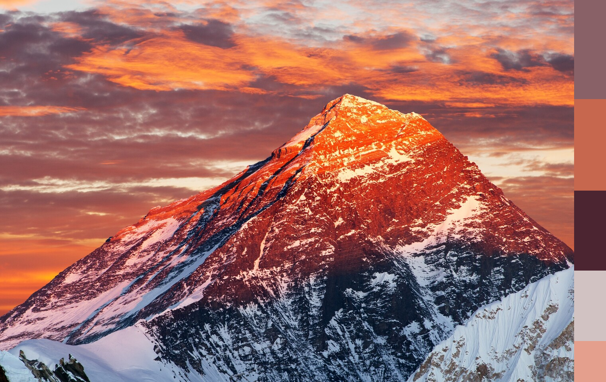

# go-check-color

<p align="center">
  
  
</p>

CLI to extract a color palette from images using median cut, count color shares, and compose output with a vertical palette strip on the right.

## Install

```bash
go build -o go-check-color ./cmd/go-check-color
```

## Usage

Single file:
```bash
./go-check-color -in input.jpg -n 8 -out out
```

Batch mode (process all images in a directory):
```bash
./go-check-color -IN IN -out out -n 8
```

Optional:
- `-json`: print palette as JSON to stdout
- `-preview palette.png`: save a separate palette preview image
- `-strip 80`: palette strip width in pixels (default 80)

## Flags
- `-in` (string): input image path (png/jpg/gif)
- `-IN` (string): input directory for batch processing
- `-out` (string): output directory (for composed images)
- `-n` (int): number of colors in the palette (default 8)
- `-json` (bool): print palette as JSON
- `-preview` (string): path to save palette preview (PNG)
- `-strip` (int): palette strip width in pixels (default 80)

## Examples
```bash
# Text output only
./go-check-color -in input.jpg -n 10

# JSON output
./go-check-color -in input.jpg -n 12 -json > palette.json

# Save palette preview
./go-check-color -in photo.png -n 8 -preview palette.png

# Batch compose images with palette strip
./go-check-color -IN In -out Out -n 8 -strip 100
```
